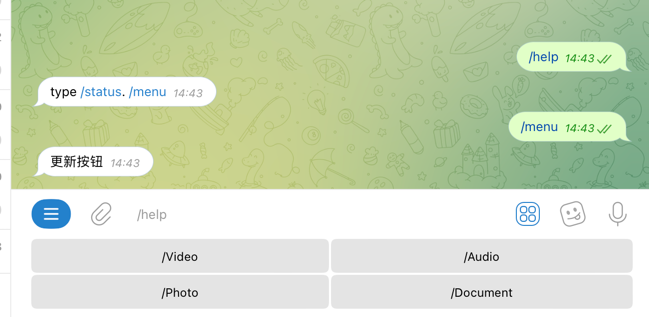
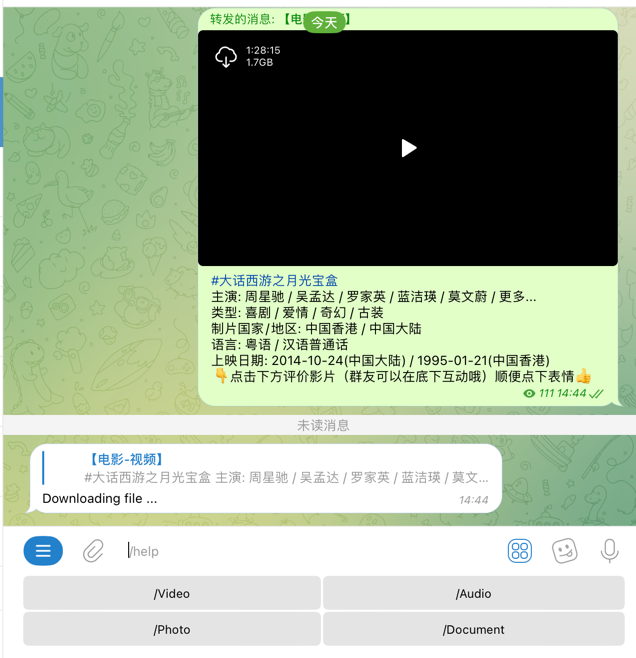
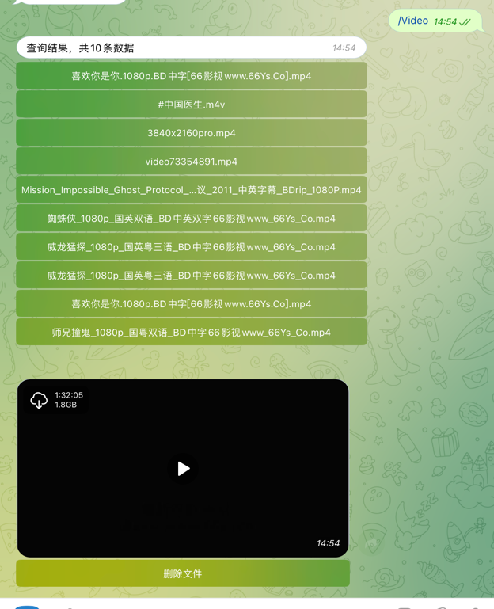

# wu-bot
一个简单的电报机器人文件下载工具。

# 支持
* 视频下载（只能下载telegram视频，如果是YouTube是不能下载的，不过可以通过其他机器人将视频下载到Telegram，再将视频发送给机器人就能下载）
* 音频下载
* 图片下载
* 文档下载
* 删除文件

# 依赖
* mysql
* [telegram-bot-api](https://github.com/tdlib/telegram-bot-api.git)需要自己搭建环境。搭建完成后替换telegram官方的api，配置文件中的 bot.api。

# telegram-bot-api 安装
1. 访问[build](https://tdlib.github.io/telegram-bot-api/build.html)网站，根据服务器系统选择响应的安装方法，没什么难度
2. 启动
``` shell
    # 在 telegram-bot-api 可执行文件下执行下面命令
    mkdir logs
    mkidr temp
    ./telegram-bot-api --api-id=24824490 --api-hash=20f7c5a420067e3754c164cceb3b23ae --local -l ./logs/telegram.log -v 3 -d /root/app/telegram-bot-api -p 8081 -t /root/app/telegram-bot-api/temp
```
参数说明：--api-id 和 --api-hash 是通过[my.telegram.org](https://my.telegram.org/auth)申请的，-l 日志文件，-d 工作目录，-p 端口， -t 临时文件

# 配置
config.yml
```yaml
bot:
    token: 电报机器人API
    api: 这里使用自己搭建的 telegram-bot-api

mysql:
  username: root
  password: 123456
  host: 127.0.0.1
  port: 3306
  database: wu-bot
```

# 截图
获取菜单

保存视频

查询视频
